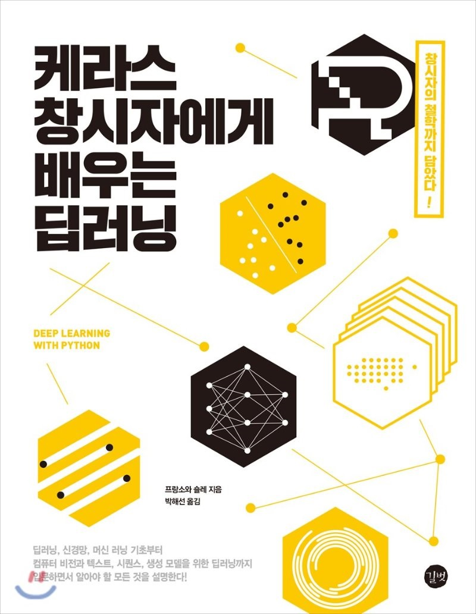

# deeplearning-with-python

케라스 창시자에게 배우는 딥러닝 책을 학습한 내용을 정리한 repository 입니다.

## 소스 코드 및 예제 파일

- 길벗 출판사 깃허브  
: [https://github.com/gilbutITbook/006975](https://github.com/gilbutITbook/006975)

- 역자의 깃허브  
: [https://github.com/rickiepark/deep-learning-with-python-notebooks](https://github.com/rickiepark/deep-learning-with-python-notebooks)
